Stephanie Kim skim9@swarthmore.edu

Sumin Byun sbyun1@swarthmore.edu

10/28/24

CS 091S: Game Systems

Remake Project

Sumin Byun and Stephanie Kim collaborated on this assignment with assistance from the following links: 

https://github.com/Skaruts/Lua-Enum/blob/master/enum.lua (enum file)

https://www.youtube.com/watch?v=L8Q0bMHccko&ab_channel=TamaraO%27Malley (jumping)

https://stackoverflow.com/questions/33510736/check-if-array-contains-specific-value (tile collision)

https://github.swarthmore.edu/gist/kohara2/9daf0b437cb874a1e2d01dd1c4d32c09 (enumerated types)

https://github.swarthmore.edu/CS91S-F24/state-flyweight/blob/main/timer.lua (timer)

https://tic80.com/learn (tic80 functions)

# REMAKE Smurf: Rescue in Gargamel's Castle
Link to game: https://github.swarthmore.edu/pages/CS91S-F24/remake-sbyun1-skim9/game/

Our lua script: remake-sbyun1-skim9/game/smurf_remake.lua

## TIC-80

TIC-80 is a free, open source fantasy computer for the creation, playing, and sharing of miniature retro games. It was created by Vadim Grigoruk (Nesbox) in March 2017 to imitate 1980's systems so users can make and edit games in the console.
TIC-80 has a console and built-in editors for code, sprites, maps, SFX, and music. It uses RAM and VRAM and supports numerous languages such as Lua and Python. TIC-80's hardware allows for up to 272kb of RAM (32kb of VRAM). It has a 240x136 pixel display, a 16 color palette, 256 foreground sprites, 256 background sprites, and a 240x136 tile map. The sprite editor has tools like brush, select, move, rotate, etc. Users can draw, drag, select, fill, and preview tiles. Maps are up to 240 cells wide and 136 cells deep.There are 4 gamepads with 8 buttons, the mouse, and keyboard for input. For sound, there are 4 channels. There can be 512kb of source or 256kb compiled binary size of code. There can be a maximum of 8 banks in cart in the Pro version of TIC-80.


## Key Points

The essence, and most fun, part of the game is jumping/jumping forward past obstacles, utilizing technique to not lose lives, and rescuing Smurfette. We captured this by successfully implementing collision detection and jump physics. We adjusted obstacles to accurately copy the difficulty level and adjusted how far the Smurf can jump forward based on obstacles, and accurately gain points for each obstacle passed. TIC-80’s display has larger tiles than Atari 2600, so we compensated by making the buildings thinner to ensure there is still some difficulty in rescuing Smurfette and the user can’t easily/consecutively jump over the buildings. In NTSC, the Atari 2600 has a 128-color palette. Thus, the original game is very colorful and has detailed maps. However, TIC-80 has a 16-color palette. This limited our color choices but we made each tile as detailed as possible to closely copy 6 original maps. In the original game, there are more levels with flying enemies (ravens and snakes), but we couldn’t implement this in our remake’s maps. We also recreated the walking sequence of the Smurf by making several sprites for walking. The original version had a song playing and sound effects for jumps and collisions. We couldn’t implement this audio in our remake.
```
--update points
  if self.v.x > 300 and points.fence_points==0 then
      points.fence_points = 400
      self.score = self.score + points.fence_points
   end
   if self.v.x > 572 and points.water_points==0 then
      points.water_points = 400
      self.score = self.score + points.water_points
   end
```


## Physics

The Smurf’s main movements are jumping up (up arrow), jumping forward (up arrow twice), moving left (left arrow), and moving right (right arrow). For walking left/right, we either subtracted from/added to the Smurf’s x value. For the two jumping options, we determined the jumping state of the Smurf based on the up arrow– not pressed, pressed once, or pressed twice. To be in the ‘pressed twice’ condition, the up arrow must be pressed consecutively within 1 second. After determining the state, we use that to either jump up. We also incorporated gravity so that the Smurf could come back to the ground. If the player successfully jumps over the obstacle, they get +400 points for each obstacle. However, it only counts the first jump over, so the player cannot keep getting points jumping over the same obstacle again and again.
``` 
--jumping state (unpressed, single, double)
   if self.pressed > 0 and btnp(0) and (t-self.pressed) < 1000 and self.vy==0 and self.alive == 1 then
      press_type = Button.double
      self.pressed = t
   elseif btnp(0) and self.vy==0 and self.alive == 1 then
      self.pressed = t
      press_type = Button.single
   else 
      press_type = Button.unpressed
   end
``` 
``` 
-- JUMP PHYSICS
   if press_type==Button.double then
      --jump forward
      if self.faceflag == 0 then
         self.vx = 1.75
         self.vy = -3.5
      elseif self.faceflag == 1 and self.v.x >=128 then 
         self.vx = -1.75
         self.vy = -3.5
      --prevent jumping left at start of game (towards house)
      elseif self.faceflag == 1 and self.v.x <128 then 
         self.vy = -3
      end
   elseif press_type == Button.single then
      --jump up
      self.vy = -3 
   elseif self.v.y >= self.ground_level then
      --stop on ground
      self.vy=0
      self.v.y = self.ground_level 
      self.vx = 0
   else 
      --come back down
      self.vy = self.vy + self.gravity
   end
``` 

## Collision

The collision detection is for the obstacles. When the Smurf collides with any of these obstacles, it gets sad and sits at the obstacle, loses a life, resets the timer for that map, and repositions to the start of the map. However, one drawback was that we were not able to reposition the smurf if the collision occured while it was in the air. We first calculated how much the smurf moved in x position in the current map to reposition the smurf to the beginning of the same map after collision. But our implementation of this calculation did not account for the collision occuring in the air, since there was a difference between where the jump started and where the collision occured. Most of the obstacles were on the ground which worked correctly, but the spider obstacle in the 5th purple scene was in the air in the original game. So we had to adjust the spider location to be on the ground, to accurately reposition the smurf after the collision with the spider. The obstacles’ tiles were put into an array separated as ‘collision tiles’. Similarly to the physics portion, we created two states– real collision and fake collision. Real collision is when the Smurf’s feet touch any of the specified collision tiles. Fake collision is when a second collision occurs within 0.05s of the previous collision. This is for when the sad Smurf is sitting at the obstacle for two seconds before repositioning to the start of the map. During those two seconds, it doesn’t count as a real collision and no lives are incorrectly lost. 
```
--real collision: -1, fake collision: 0
   t = time()
   local how_far = 0 --how far smurf is from start of map
   --if smurf is on collision tile
   if contains(collision_tiles, self.tile_type) then
      --if collision happened within 0.05s of previous collision
      if self.collided > 0 and (t-self.collided) < 50 then
         --fake collision
         self.collision_type = 0 
         self.collided = t
      else
         --real collision
         self.collided = t
         self.collision_type = -1
      end
   end
```
```
   if self.collision_type == -1 then
      --real collision
      self.alive = 0
      how_far = (self.v.x%230) - 5
      Timer.during(2000, function() spr(114,self.v.x%230,self.v.y+5,0,1,self.faceflag,0,2,3) end)
      Timer.after(2000, function() self.v.x = self.v.x-how_far end)
      Timer.after(2000, function() self.faceflag = 0 end) --reposition facing right side
      Timer.after(2000, function() self.lifespan=100 end)
      self:countdownBar()
      self.lives = self.lives - 1
      if self.lives > 0 then
         Timer.after(2000, function() self.alive=1 end)
      else
         --game over
         map(180,0,30,17,0,0)

      end
      self.collision_type = 1
   elseif self.collision_type == 0 then
      --fake collision    
      self.collision_type = 1
   end
```


## Sprites/Maps
Original maps:
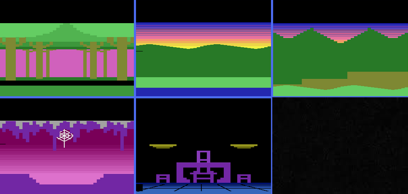 

We made 6 maps on TIC-80, shown below. We used if/elseif loop to show the corresponding map based on the Smurf’s x and y coordinates.
```
   if self.v.x <= 230 then 
      current_map = 1
      map(0,0,30,17,0,0)
      self.ground_level = 90
   --fence scene
   elseif (self.v.x > 230 and self.v.x <= 460) then
      current_map = 2
      map(30,0,30,17,0,0) 
      self.ground_level = 90
```
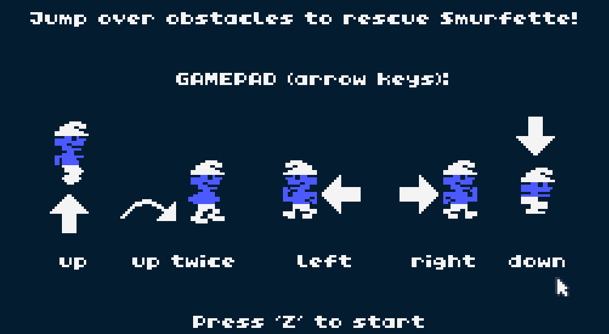 
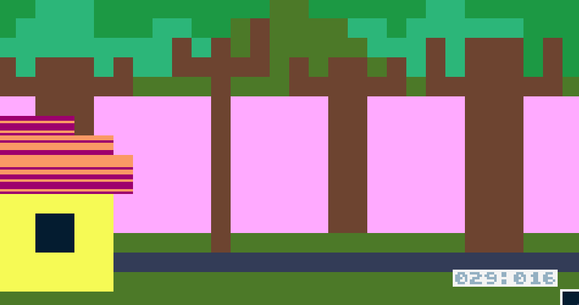
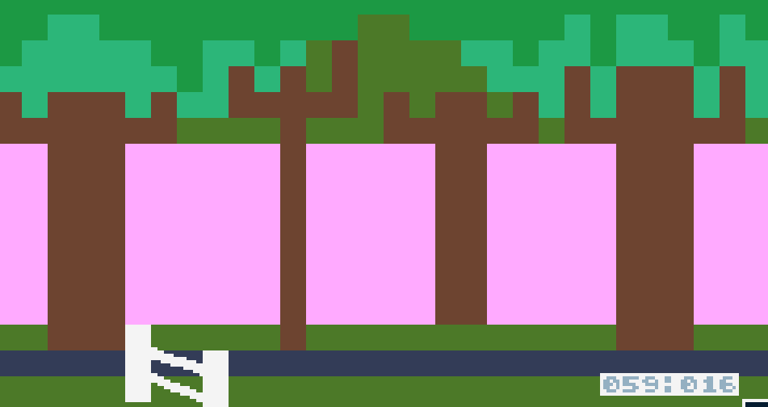
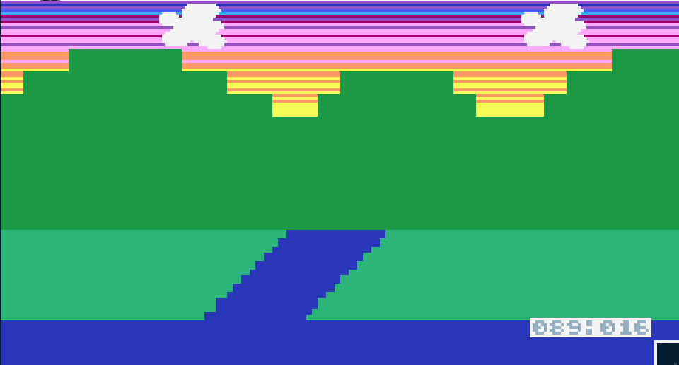
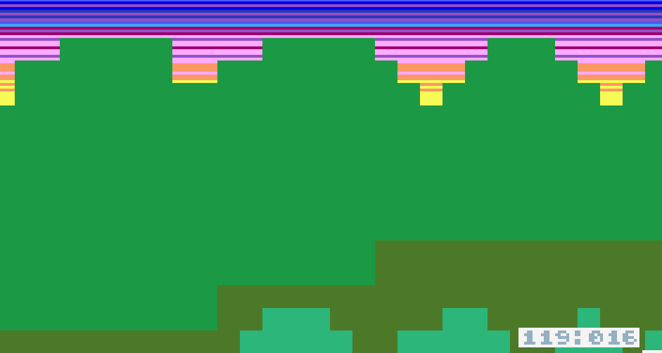
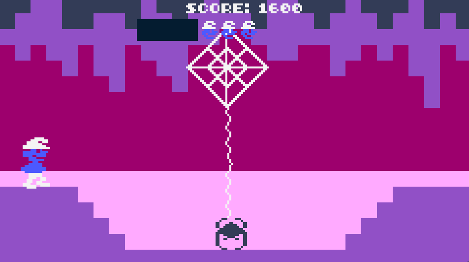
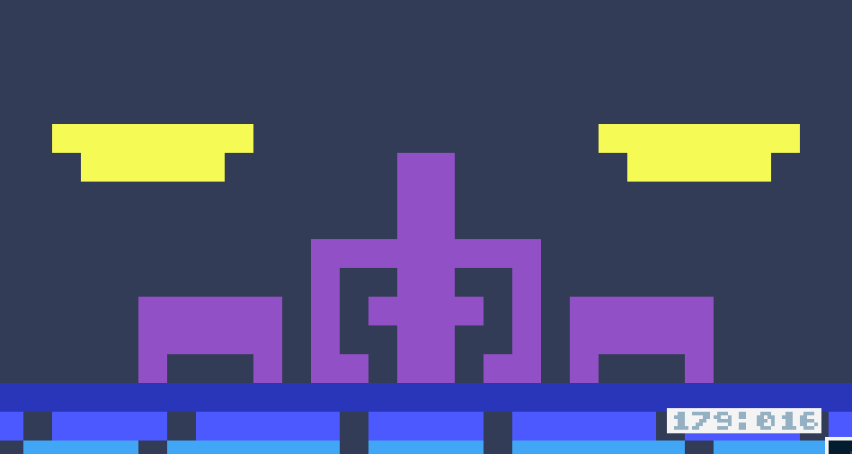
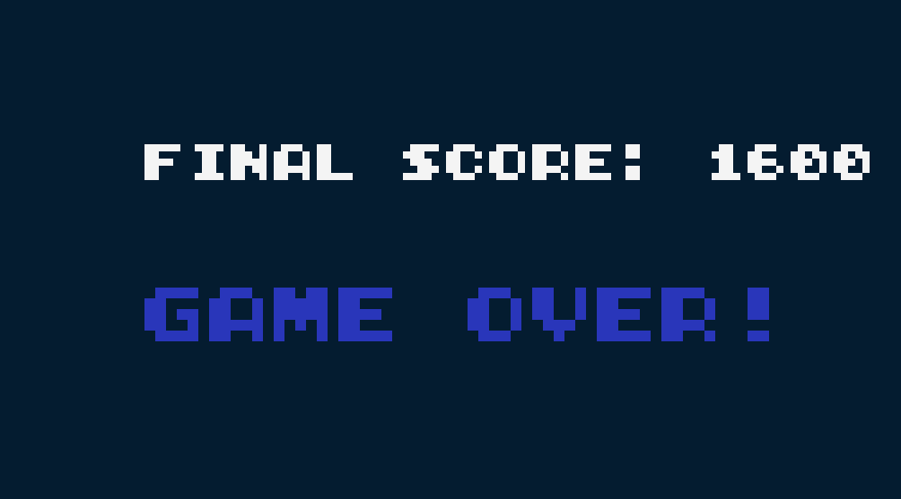
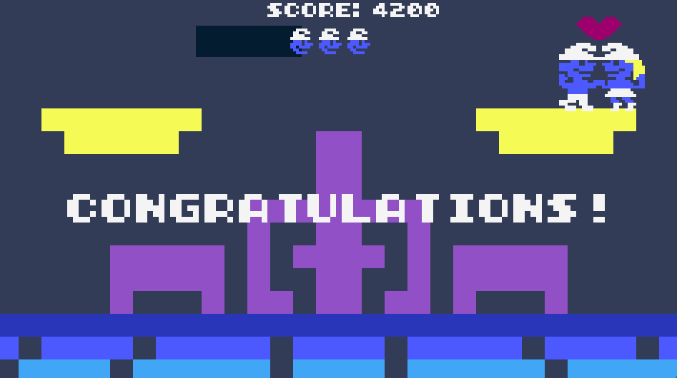

We drew 6 maps, instruction screen, game over screen, congratulations message, and the numerous sprites of Smurf and Smurfette. To accurately replicate the Smurf, we made a total of 7 sprites for Smurf: 3 for walking, 1 for squatting, 1 for jumping, 1 for just sitting down when Smurf bumped into obstacles/dead, and 1 for when Smurf and Smurfette meet at the end. We also created an additional default state of Smurfette, 3 sprites of spider, and the mini version of smurf head to represent the remaining number of lives at the top of the screen. 

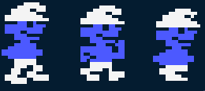
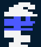

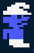
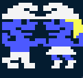

Like mentioned above, one limitation was TIC-80’s small color palette compared to Atari. There were some parts of the original map with detailed color gradients for the sunset and roof of the Smurf’s house. However, since we had only 16 colors, our gradients were a bit less detailed.
Also, TIC-80’s screen is wider but shorter than Atari’s. Thus, there is a black block at the top of the screen in the original game where it shows the score and the remaining lives. However, once we put the black block in TIC-80, we had too little space left to draw the maps and the sprites, so we decided to leave out the top black block and draw the score and remaining lives on the top of our background instead. To make the remaining lives show well, we drew the black countdown bar behind the Smurf heads. Regarding the countdown bar per map, we made sure that going to the previous map does not refill the countdown bar, so the player can't cheat and must go to the next level before 10 seconds in order to avoid losing a life.


## Feedback

We were told that the fence and spider web were not drawn well, so we made the fence tiles more detailed and used line() to draw the spider web. One of the benefits of TIC-80 was that we could utilize the line() to draw the spider web. Moreover, players pointed out that in the original game, the spider moves up and down in the air. However, due to limitations of our remake, collisions can only happen on the ground, so we couldn’t implement this aspect. We also got feedback that control keys were not very obvious, so we added an instruction screen that clearly explains the control keys and the goal of the game. Also, to better illustrate the ending of the game, we added a ‘game over’ screen that shows either a congratulations' or ‘final score’/’game over’ message.
